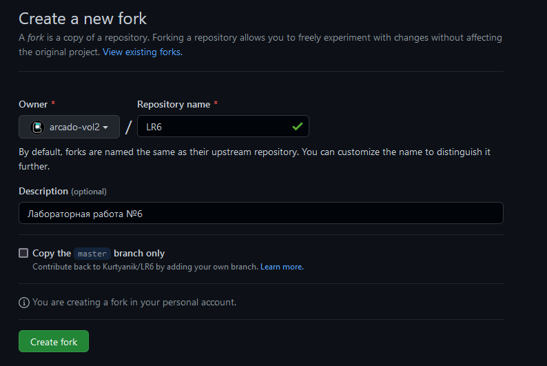
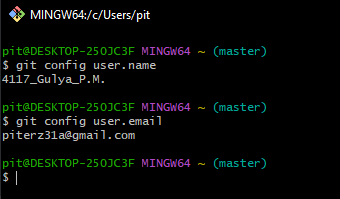
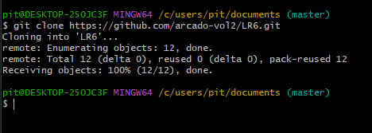
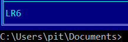

# Лабораторная работа №6
#### Цель лабораторной работы:
Изучение базовых возможностей системы управления версиями, опыт работы с Git Api, опыт работы с локальным и удаленным  репозиторием.
#### Ход работы:
Скриншоты этапов работы расположены в папке screenshoo проекта
1. Создаем аккаунт GitHub
2. Делаем копию в личное хранилище из https://github.com/Kurtyanik/LR6/
	- Для этого производи fork с пощью интерфейса сайта.
	 
3. Устанавливаем Git
4. Настраиваем клиент Git, вводим имя пользователя и email
	- Для этого необходимо последовательно выполнить команды\
	`git config user.name "<username>"`\
	`git config user.email "<email>"`\
	 
5. клонируем удаленный репозиторий на пк
   - Для этого необходимо выполнить команду `git clone <repository address>`, предварительно перейдя в каталог, в который будет производится клонирование\
      \
      	
6. Добавляем файл через интерфейс GitHub. Подтягиваем изменения в локальный репозиторий.
   - Подтягиваем изменения при помощи команды `git pull`\
    
    
    
    
7. Получаем историю операций для каждой из веток
   - Получаем историю операций для ветки, выполняя команду
    `git log`
    
   - Меняем текущую ветку, выполняя команду
    `git checkout branch1`
    
8. Смотрим последние изменения
   - Последние изменения отображаются, при выполнении команды
    `git log`
    
9. Выполняем слияние в ветку master, разрешив конфликт
   - Выполняем слияение в ветку master, последовательно выполнив несколько команд
     - переходим в ветку master, при помощи команды 
      `git checkout master`
      
     - начинаем слияние веток, использую команду
      `git merge branch1`
      
     - разрешаем конфликт, редактируя текстовый файл                                                
      
      
     - закрепляем изменения командами
      `git add .`
      `git commit -m "<message>"`
      
10. Удаляем побочную ветку, после слияния
    - Для удаления ветки, применим команду
      `git branch --delete branch1`
      
11. Фиксируем изменения
    - Зафиксируем изменения выполнив команды
      `git add .`
      `git commit -m "<message>"`
12. Делаем откат коммита
    - Выполняем откат последнего коммита, при помощи команды
      `git reset --soft HEAD~`
      
13. Создадим ветку для отчета
    - Создаем ветку для отчета, выполнив команду
      `git branch -b report`
      
14. Оформим отчет в файле README.md
15. Получим историю операций в форматированном виде и сделаем финальную фиксацию изменений
    - Получим историю, выполнив команду
      `git log --pretty=medium --abbrev-commit `
      
16. Отправим локальные изменения в сетевое хранилище GitHub
    - Для отправки локальных изменений в сетевое хранилище GitHub, выполним команду
      `git push`
    - Также удалим remote ветку branch, посредством команды
      `git push origin --delete branch1`

##### Вывод:
Нам удалось изучить базовые возможности системы управления версиями, мы получили опыт работы с Git Api, опыт работы с локальным и удаленным  репозиторием.
